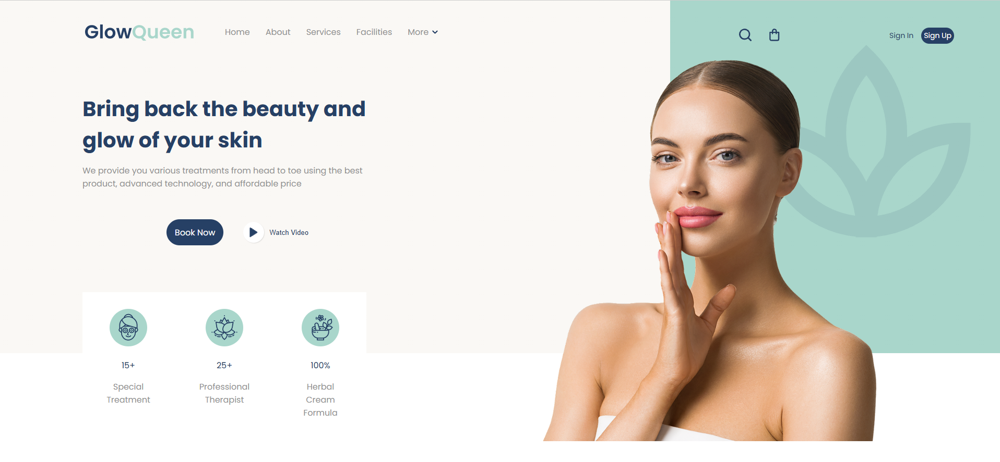

<p align="right">
  <a href="./README.md">🇺🇸 English</a> | 🇪🇸 Español
</p>

<h1 align="center">✨ Header Spa & Beauty</h1>

<p align="center">
Proyecto Frontend desarrollado como práctica de maquetación e implementación visual siguiendo los cursos de Conquer Blocks.
</p>

<p align="center">
Construido con HTML, CSS y SCSS
</p>

<p align="center">

<a href="https://edgarmadrid.github.io/Header_Spa_Beauty/">

</a>

</p>

---

<p align="center">


</p>

---

## 🔗 Demo

<p align="center">
<a href="https://edgarmadrid.github.io/Header_Spa_Beauty/">
Ver Demo →
</a>
</p>

---

## ✨ Sobre el proyecto

**Header Spa & Beauty** es un proyecto frontend enfocado en reproducir un diseño con la mayor fidelidad posible aplicando buenas prácticas de desarrollo.

Fue desarrollado aplicando conocimientos adquiridos durante la formación de **Conquer Blocks**, priorizando estructura limpia, mantenibilidad y diseño responsive.

Durante el desarrollo se trabajó en:

✅ Estructura semántica con HTML  
✅ Arquitectura y estilos con SCSS  
✅ Adaptación responsive  
✅ Implementación fiel al diseño  
✅ Integración de SVG  
✅ Estados hover interactivos  
✅ Organización del código  

---

## 🎯 Objetivo

Desarrollar una interfaz estática que reproduzca fielmente el diseño original manteniendo una arquitectura frontend limpia y escalable.

Se trabajó especialmente en:

- Fidelidad del diseño  
- Semántica del código  
- Adaptación responsive  
- Estados interactivos  
- Organización con SCSS  

---

## 🚀 Tecnologías

<div align="center">

| Tecnología | Uso |
|-----------|------|
| 🌐 HTML5 | Estructura |
| 🎨 CSS3 | Estilos |
| ⚡ SCSS | Arquitectura |
| 📱 Responsive | Adaptabilidad |

</div>

---

## 📷 Vista previa

<p align="center">

</p>

---

## 🛠️ Ejecutar localmente

Clonar repositorio:

```bash
git clone https://github.com/EdgarMadrid/Header_Spa_Beauty.git
```

Entrar al proyecto:

```bash
cd Header_Spa_Beauty
```

Abrir:

```bash
index.html
```

Compilar SCSS:

```bash
sass --watch scss:css
```

---

## 📚 Objetivos de aprendizaje

Este proyecto ayudó a reforzar:

- Arquitectura frontend  
- Diseño responsive  
- Flujo con SCSS  
- HTML semántico  
- Precisión visual  

---

## 👨‍💻 Autor

<p align="center">

<a href="https://github.com/EdgarMadrid">

</a>

<a href="https://www.linkedin.com/in/emadrid110">

</a>

</p>

---

<p align="center">
⭐ Si te gustó este proyecto puedes darle una estrella en GitHub
</p>
